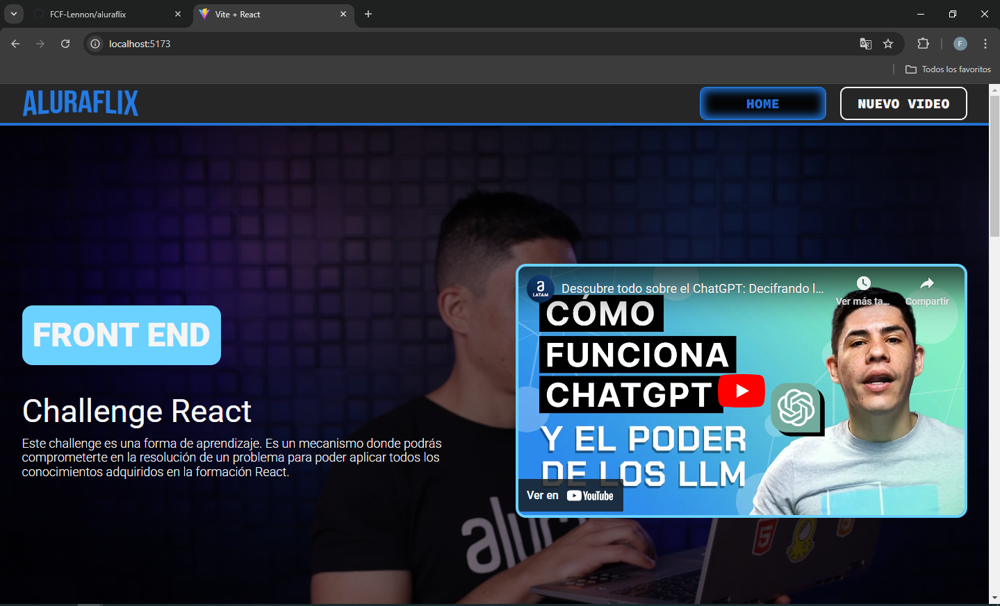

# Challenger de Gestión de Videos para Alura Latam - One Oracle

Este proyecto es una aplicación web para gestionar videos, permitiendo a los usuarios visualizar, agregar, editar y eliminar videos.



## Requisitos Previos

Asegúrate de tener los siguientes programas instalados en tu máquina:

- **Node.js** (versión 16 o superior)
- **npm** (administrador de paquetes de Node.js)

Si no tienes estos programas instalados, puedes descargarlos e instalarlos desde [nodejs.org](https://nodejs.org/).

## Instalación

Sigue estos pasos para levantar el proyecto localmente:

1. **Clona el repositorio:**
   Abre la terminal o línea de comandos y ejecuta el siguiente comando:
   
    ```git clone <https://github.com/FCF-Lennon/aluraflix> ```
2. **Accede al directorio del proyecto:** Cambia al directorio del proyecto clonado:
  
    ```cd aluraflix ```

3. **Instala las dependencias:** Para instalar las dependencias necesarias, ejecuta el siguiente comando:
  
    ```npm install```

4. **Levanta el servidor de desarrollo:** Una vez que las dependencias estén instaladas, inicia el servidor de desarrollo con:

    ```npm run dev```

    Esto abrirá la aplicación en tu navegador en la URL ```http://localhost:3000```

5. **Levanta el servidor de la API:** Para iniciar el servidor que maneja los datos de la aplicación (usando json-server), ejecuta:

    ```npm run server```

    Esto levantará el servidor de la API en la URL ```http://localhost:5000```

**Nota:** Asegúrate de que ambos servidores estén corriendo para que la aplicación funcione correctamente.

## Estructura del Proyecto

El proyecto tiene la siguiente estructura:

- **src/:** Contiene el código fuente de la aplicación.
    - **components/:** Componentes reutilizables de la interfaz.
    - **pages/:** Páginas principales de la aplicación.
    - **services/:** Servicios para la gestión de la API.
- **public/:** Archivos estáticos como el index.html.

## Tecnologías Utilizadas

- **React.js:** Biblioteca JavaScript para construir la interfaz de usuario.
- **React Router:** Para el manejo de la navegación entre páginas.
- **Styled Components:** Para el diseño y estilo de la aplicación.
- **Vite:** Herramienta de construcción y servidor de desarrollo.
- **json-server:** Para simular una API RESTful localmente.
- 
## Funcionalidades

- Visualización de videos destacados.
- Agregar, editar y eliminar videos.
- Integración con una API local utilizando json-server para gestionar videos.

## Consideraciones

- Asegúrate de que tanto el servidor de desarrollo como el servidor de la API estén corriendo al mismo tiempo para poder usar la aplicación de manera correcta.